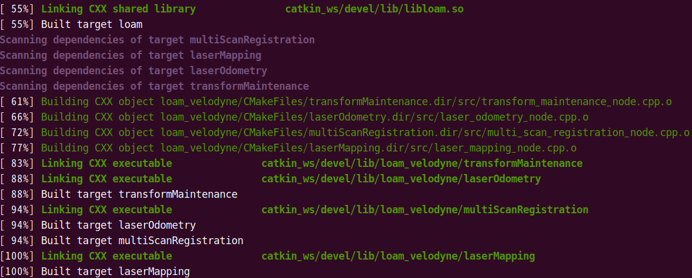
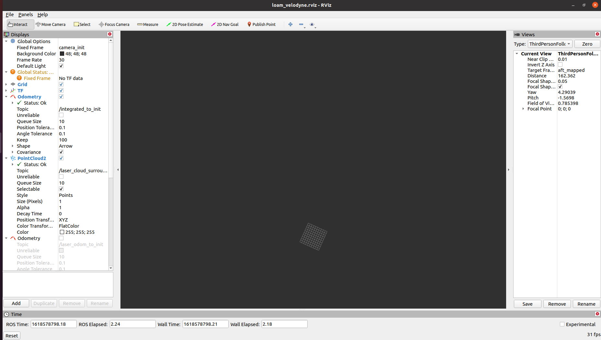

# Slam Analysis
## Loam analysis  
<a href = "https://github.com/laboshinl/loam_velodyne">Original Code Link</a> 

- - -
### Prior knowledge
- Env
  - ROS/Ubuntu 20.04
    - ROS
      - 로봇/센서들을 위한 Meta OS
      - 지원되는 OS는 Ubuntu
      - 실행 단위는 node
        - 하나의 프로그램은 1개 이상의 Node로 실행.
	-  Node는 execute file을 실행시킨 것.
- Launch
  - XML형식을 취하고 있음.
  - 여기서 Node dependency를 설정.
  - `<Node></Node>`안에 적힌 file을 실행.
    - Loam의 경우 4개의 node를 실행하게됨.  
 

### Compile && Running
- Compile
  - success
    
- Run
  - Vanilla (순수한 loam compile)
    - without data   
      
      
      > 실행을 하면 자동으로 ui가 뜬다.  
    - with data
